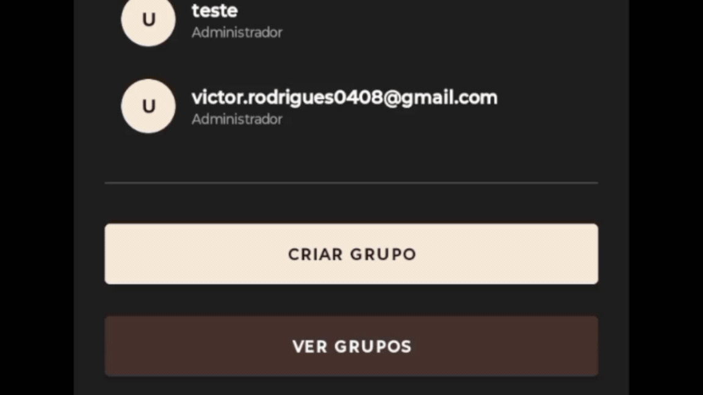

# Plataforma Colaborativa de Trabalho Remoto


<p align="center">
  Aplicativo mobile desenvolvido para auxiliar na organização,
  distribuição e acompanhamento de trabalhos realizados por
  equipes em ambientes de trabalho remoto.
</p>

---

## Sobre o Projeto

A Plataforma Colaborativa de Trabalho Remoto é um aplicativo mobile desenvolvido com o objetivo de centralizar informações relacionadas às atividades de equipes que trabalham remotamente.

A aplicação permite o gerenciamento de usuários, equipes e trabalhos, proporcionando uma forma organizada de acompanhar as atividades e facilitar a colaboração entre os integrantes.

O projeto foi desenvolvido como Trabalho de Conclusão de Curso (TCC).

---

## Funcionalidades

* Cadastro de usuários
* Autenticação por e-mail e senha
* Gerenciamento de informações do usuário
* Criação e gerenciamento de equipes
* Gerenciamento de membros das equipes
* Envio e gerenciamento de convites
* Solicitações de entrada em equipes
* Cadastro e gerenciamento de trabalhos
* Acompanhamento das atividades

---

## Demonstração

### Autenticação

O usuário pode realizar seu cadastro e acessar a plataforma utilizando e-mail e senha.

<p align="center">
  
</p>

### Cadastro

O usuário pode realizar seu cadastro na plataforma informando seu nome, profissão, e-mail e senha.

<p align="center">
  
</p>

### Tela Inicial

Após a autenticação, o usuário é direcionado à tela principal da aplicação.

<p align="center">
  
</p>

### Gerenciamento de Equipes

O usuário pode criar e gerenciar equipes dentro da plataforma.

<p align="center">
  
</p>

### Convites

Os usuários podem enviar, receber e gerenciar convites relacionados às equipes.

<p align="center">
  
</p>

### Gerenciamento de Trabalhos

Os trabalhos podem ser cadastrados e gerenciados dentro das equipes.

<p align="center">
  
</p>

### Perfil do Usuário

O usuário pode consultar e gerenciar suas informações pessoais cadastradas na plataforma.

<p align="center">
  
</p>

---

## Tecnologias Utilizadas

|                                                                     | Tecnologia              | Aplicação                               |
| :-----------------------------------------------------------------: | ----------------------- | --------------------------------------- |
|         | Kotlin                  | Desenvolvimento da aplicação Android    |
|  | Android Studio          | Ambiente de desenvolvimento             |
|       | Firebase Authentication | Autenticação dos usuários               |
|       | Firebase Firestore      | Armazenamento e gerenciamento dos dados |
|     | Material Design         | Desenvolvimento da interface            |
|         | Kotlin Coroutines       | Execução de operações assíncronas       |

---

## Banco de Dados

A aplicação utiliza o **Firebase Cloud Firestore** como banco de dados não relacional (NoSQL).

O sistema possui entidades que representam usuários e trabalhos, permitindo o relacionamento entre eles. Um usuário pode participar de vários trabalhos, enquanto um trabalho pode contar com a participação de vários usuários, caracterizando uma relação **muitos para muitos (N:N)**.

### Estrutura do Banco de Dados

```text
┌──────────────┐        (0,n)        ┌─────────────────────┐        (0,n)        ┌──────────────┐
│   Usuário    │ ──────────────────► │  participa / realiza │ ◄────────────────── │   Trabalho   │
└──────────────┘                     └─────────────────────┘                     └──────────────┘
       │                                                                                │
       │                                                                                │
       ▼                                                                                ▼
id, nome, email, senha,                                                          id, titulo, prazo,
profissao                                                                          descricao, categoria
---

## Arquitetura

O projeto utiliza uma arquitetura baseada em um modelo MVC simplificado, no qual cada tela principal da aplicação é representada por uma `Activity`.

A comunicação com o Firebase é realizada diretamente por meio dos SDKs disponibilizados pela plataforma, utilizando operações assíncronas com Kotlin Coroutines.

O fluxo de autenticação utiliza o Firebase Authentication, enquanto os dados complementares dos usuários e demais informações da aplicação são armazenados no Firestore.

---

## Estrutura do Projeto

```text
CTR_App-Comunidade_de_Trabalho_Remoto_Aplicativo/
│
├── app/
│   └── ...
│
├── docs/
│   ├── gifs/
│   │   ├── login.gif
│   │   ├── cadastro.gif
│   │   ├── tela-inicial.gif
│   │   ├── criar-equipe.gif
│   │   ├── convites.gif
│   │   ├── criar-trabalho.gif
│   │   └── perfil.gif
│   │
│   └── manual/
│       └── manual-do-usuario.md
│
├── README.md
└── ...
```

---

## Manual do Usuário

O manual apresenta as principais funcionalidades da aplicação e fornece instruções para utilização do sistema.

[Manual do Usuário](docs/manual/manual-do-usuario.md)

---

## Projeto Acadêmico

**Título:** Plataforma Colaborativa de Trabalho Remoto

**Tipo:** Trabalho de Conclusão de Curso

**Plataforma:** Android

**Linguagem:** Kotlin

**Banco de dados:** Firebase Firestore

**Autenticação:** Firebase Authentication

**Interface:** Material Design

### Sobre o projeto

A Plataforma Colaborativa de Trabalho Remoto (CTR) é um aplicativo mobile Android desenvolvido para apoiar a colaboração, organização e acompanhamento de atividades em equipes que trabalham remotamente.

O aplicativo permite o cadastro e autenticação de usuários, criação e gerenciamento de equipes, criação de equipes privadas, envio de convites por e-mail e pedidos de entrada em equipes.

Também possibilita a criação, edição, consulta e exclusão de trabalhos (tarefas), além do acompanhamento de seus status. O sistema conta ainda com gerenciamento de membros, perfil do usuário e notificações de convites pendentes.

Os dados são armazenados na nuvem utilizando o Firebase Cloud Firestore, enquanto a autenticação é realizada por meio do Firebase Authentication.
